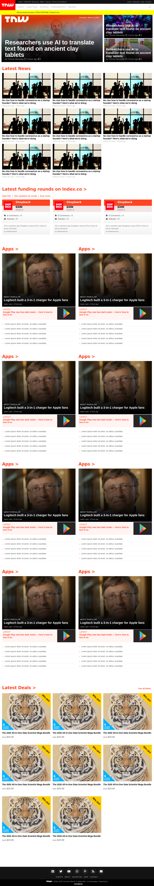

# Responsive web : Creating a responsive web page
# The-next-web clone


## Description
In this project, we tried to build a clone of . The purpose of this exercise is to learn about web responsiveness and its best practices.


## Built With
- HTML & CSS
- CSS grid
- CSS flex box
- media queries


## Usage
```Git
git clone https://github.com/tacodtripe/The-Next-Web-Clone.git
cd The-Next-Web-Clone
git checkout UXdesign
firefox index.html
```


## Demo
https://rawcdn.githack.com/tacodtripe/The-Next-Web-Clone/98de4adbe8396e8ed4db3c6b5b2f14cc2b051f2d/index.html


## Authors

👨 **Raul Figueroa**
- Twitter: https://twitter.com/raul_figueroa17
- Github: https://github.com/tacodtripe
- Linkedin: https://www.linkedin.com/in/luis-raul-figueroa-soto-63411118a/

👩 **Houda Cherkaoui**
- Twitter: https://twitter.com/Houda59579688
- Github: https://github.com/CalyCherkaoui/
- Linkedin: https://www.linkedin.com/in/houda-cherkaoui-64106395/


## Contributing
Pull requests are welcome. For major changes, please open an issue first to discuss what you would like to change.
Support this project with a ⭐️ and let us now if you would like to become a contributor!


## A screenshot of the project:

### Screenshot of the desktop version:


### Screenshot of the tablet version:



### Screenshot of the mobile version:


